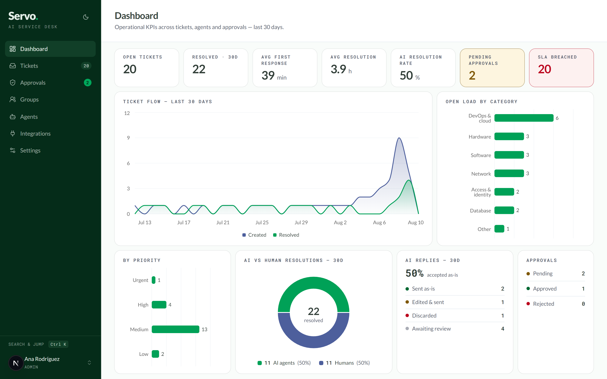
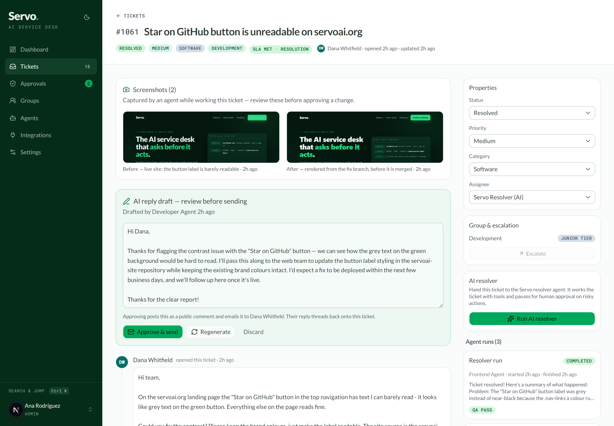
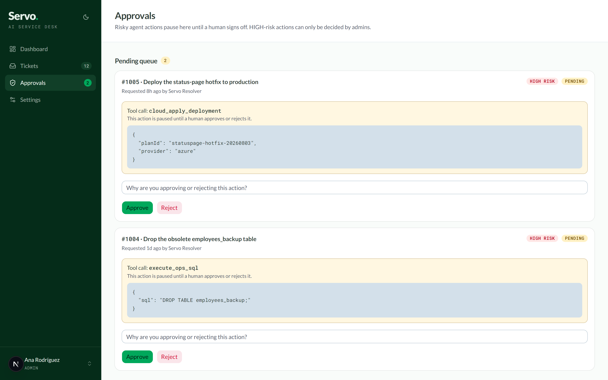
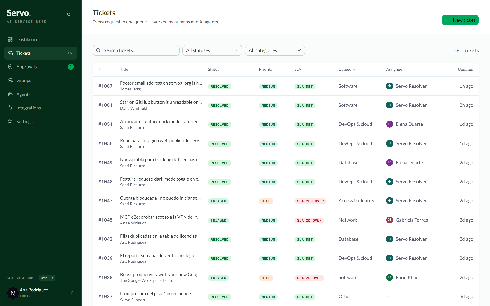
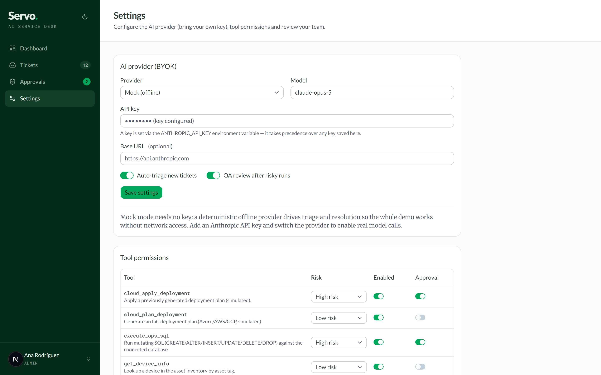
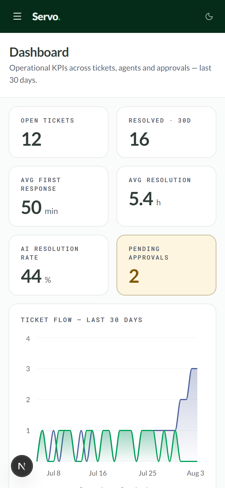

<p align="center">
  
</p>

# Servo

**An open-source, self-hostable AI-powered service desk.** Tickets can be assigned to humans *or* AI agents. AI agents triage incoming tickets, resolve them using real tools (SQL against a sandboxed ops database, device inventory lookups, simulated GitHub and cloud integrations), pause for **human approval** before risky actions, get an automated **QA review** afterwards, and everything feeds a **KPI dashboard**.

<p align="center">
  
</p>

Bring your own Anthropic API key for real model calls — or run entirely offline with the built-in deterministic mock provider (the default). The whole demo works without a key, a network connection, or an account anywhere.

> **Status: proof of concept.** Servo is a POC built to demonstrate an agentic service-desk architecture. It is not hardened for production use — see the [security disclaimer](#security-disclaimer) below.

## Features

- **Tickets for humans and AI** — assign any ticket to a human agent or to the AI resolver; the resolver works the ticket end to end.
- **Automatic triage** — new tickets are categorized, prioritized, and routed by an AI triage agent (toggleable in Settings).
- **Tool-using resolver** — the AI resolver operates a registry of 10 tools: read-only and mutating SQL against a sandboxed ops database, device inventory lookups, password resets, simulated GitHub repo/PR operations, and simulated cloud deployment plan/apply.
- **Human-approval gates** — each tool carries a risk level (LOW/MEDIUM/HIGH) and an editable *requires approval* policy. When the agent reaches a gated tool, the run pauses, an approval lands in the Approvals inbox, and the run resumes exactly where it left off after a decision. Rejections flow back to the agent, which adapts instead of retrying.
- **Automated QA review** — after a run that executed medium/high-risk tools, a QA agent reviews the transcript and issues a PASS/FAIL verdict; failures reassign the ticket to a human with an explanatory comment.
- **KPI dashboard** — open tickets, resolution times, first-response times, AI-vs-human resolution split, approval stats, ticket volume over 30 days.
- **BYOK with offline mock mode** — plug in an Anthropic API key via Settings or environment variable, or run fully offline with the deterministic mock provider.
- **Groups & escalation hierarchy** — assignment groups (Development, Analytics, Engineering…) own ticket categories; members carry JUNIOR → MID → SENIOR tiers per group, or STANDALONE for specialists outside the ladder. Priority sets the minimum tier, and any agent can escalate a ticket up a tier or across to another group — the least-loaded eligible member picks it up and the move is logged on the timeline.
- **Real GitHub integration** — add a personal access token (env `GITHUB_TOKEN` or Settings, with a Test-token button) and `github_create_repo` / `github_open_pr` hit the real GitHub API — still behind their risk levels and approval gates. Without a token they stay simulated so the offline demo keeps working. A base-URL override supports GitHub Enterprise.
- **Email notifications (SMTP)** — real outbound email on the moments that matter: ticket received / resolved to the requester, pending approvals to every admin. Configure any SMTP server via `SMTP_URL` (or Settings), send a test email from the UI, and sending stays best-effort so a broken mail setup never blocks ticket flows.
- **Custom tools & integrations** — admins define new HTTP tools from Settings (method, URL, headers, body template with `{input.field}` placeholders, and a stored secret injected via `{secret}`). They join the resolver's registry like built-in tools, with the same risk levels and human-approval gates — the fastest path to integrating a webhook, an internal API, or a SaaS endpoint.
- **Specialized agents as `.md` files** — resolver personas (Analytics, Developer, Cybersecurity…) are Markdown documents with YAML frontmatter (`name`, `categories`, `tools`) and a system-prompt body. Drop files into `agents/` or create/edit them from the UI; the resolver automatically uses the enabled specialist covering the ticket's category, with its tool set narrowed to the profile's allowlist.
- **Role-based permissions** — ADMIN, AGENT, and REQUESTER roles with a permission matrix; HIGH-risk approvals and group management are admin-only.
- **Demo user switcher** — hop between seeded users to experience every role without an auth provider.
- **shadcn/ui frontend** — Tailwind v4 + [shadcn/ui](https://ui.shadcn.com) components and charts (Recharts), themed with Servo's green-accent OKLCH palette; light mode by default with a dark-mode toggle.
- **Docker-ready** — one `docker compose up --build` gives you a self-contained instance with persistent SQLite volumes.

## Screenshots

| Agent run with human approval + QA | Approvals inbox |
|---|---|
|  |  |

| Ticket queue | Settings — BYOK & tool permissions |
|---|---|
|  |  |

<p align="center">
  <br/>
  <em>Fully responsive — same app on mobile.</em>
</p>

## Quickstart

Requires **Node.js 20+**.

```bash
npm install
npm run setup   # prisma generate + db push + seed demo data
npm run dev
```

Open [http://localhost:3000](http://localhost:3000). The database is SQLite — no external services needed.

### Run with Docker

```bash
docker compose up --build
```

The container creates and seeds its SQLite databases on a named volume (`/data`) on first boot, then serves on [http://localhost:3000](http://localhost:3000). Set `ANTHROPIC_API_KEY` in `docker-compose.yml` to enable real model calls; without it Servo runs in mock mode.

`npm run setup` seeds ~28 tickets across the last 30 days, completed AI runs with full step traces, and two runs currently paused waiting for approval, so the dashboard and approvals inbox are meaningful from the first render. Run `npm run seed` any time to reset the demo data.

## Bring your own key (BYOK)

Servo ships in **mock mode** by default: a deterministic provider that scripts realistic tool-using conversations from the ticket text, so triage, resolution, approvals, and QA all work with no API key and no network access.

For real model calls Servo speaks **two provider dialects**, configurable in **Settings → AI provider** (with quick-fill presets and a **Test connection** button):

| Provider kind | Works with | Env var | Example |
|---|---|---|---|
| `anthropic` | Anthropic API + Anthropic-compatible endpoints | `ANTHROPIC_API_KEY` | Z.AI GLM: base URL `https://api.z.ai/api/anthropic`, model `glm-5.2` |
| `openai` | Any OpenAI-compatible Chat Completions endpoint | `OPENAI_API_KEY` | OpenAI (`gpt-5.1`), Azure OpenAI (`https://<resource>.openai.azure.com/openai/v1`), Z.AI (`https://api.z.ai/api/paas/v4`), vLLM, **Ollama keyless** (`http://localhost:11434/v1`) |

Notes:

- The env var for the selected provider always takes precedence over a key stored in Settings.
- `openai` endpoints with a **base URL but no key** are allowed — that is how keyless local servers like Ollama work.
- If the selected provider has no usable credentials, Servo falls back to mock mode (Settings shows a warning) so the app never breaks.
- The agent loop, approval gates, and QA are provider-agnostic: tool use is translated to Anthropic `tool_use` blocks or OpenAI function `tool_calls` automatically.

> **POC caveat:** a key saved through Settings is stored **in plain text in the local SQLite database**. Fine for a local demo; do not do this with a production key on a shared machine. Prefer the environment variable.

## Demo users

The seed creates these users, switchable from the user switcher in the sidebar:

| User | Role | What they can do |
|---|---|---|
| Ana Rodríguez | ADMIN | Everything, including Settings, groups, and HIGH-risk approvals |
| Bruno Chen | AGENT | Work tickets, run the AI, decide LOW/MEDIUM-risk approvals; SENIOR in Engineering |
| Elena Duarte, Farid Khan, Gabriela Torres, Hiro Tanaka | AGENT | Group members across Development / Analytics / Engineering at junior→senior tiers |
| Iris Volkov | AGENT | STANDALONE security specialist in Engineering (outside the tier ladder) |
| Carla Méndez | REQUESTER | Create tickets, comment |
| Diego Fontaine | REQUESTER | Create tickets, comment |
| Servo Triage / Resolver / QA | AI_AGENT | The three AI agents (not switchable personas — they act via runs) |

## How the agent loop works

1. **Triage** — on ticket creation (when auto-triage is on), the triage agent reads the ticket and returns a category, priority, and an AI-or-human routing decision with a rationale posted as a system comment. Tickets that map to available tools are assigned to the AI resolver.
2. **Resolve with tools** — the resolver runs a conversation loop (max 12 iterations): the model plans, calls tools, receives results, and continues. Every text turn, tool call, and tool result is persisted as a run step you can inspect on the ticket timeline.
3. **Approval pause** — when a tool policy says *requires approval*, the run stops, its full conversation is persisted, and an approval request appears in the Approvals inbox and on the ticket. On approval the tool executes and the loop continues from the exact same conversation state; on rejection the agent receives the rejection as an error result and wraps up gracefully.
4. **QA** — if the run executed medium/high-risk tools and QA is enabled, a reviewer agent audits the transcript. A FAIL verdict reassigns the ticket to a human agent with a system comment.

See [docs/ARCHITECTURE.md](docs/ARCHITECTURE.md) for the full engine design, [docs/DEMO.md](docs/DEMO.md) for a 5-minute guided tour, and [docs/DESIGN.md](docs/DESIGN.md) for the color system (WCAG-audited light/dark tokens).

## Project structure

```
agents/
  *.md                 # specialized resolver agents (frontmatter + system prompt)
prisma/
  schema.prisma        # data model (SQLite; enum-likes are strings)
  seed.ts              # demo users, tickets, runs, approvals, sandbox ops DB
src/
  app/                 # Next.js App Router pages + API routes
    api/               # tickets, runs, approvals, settings, kpis, users
    tickets/           # ticket list, new ticket, ticket detail
    dashboard/         # KPI dashboard
    approvals/         # approvals inbox
    groups/            # assignment groups + escalation tiers
    agents/            # specialized .md agent profiles
    settings/          # BYOK + tool policies (admin only)
  lib/
    ai/                # provider abstraction, mock provider, tools, prompts, engine
    db.ts / opsdb.ts   # app DB and sandboxed ops DB clients
    auth.ts            # cookie-based demo auth
    permissions.ts     # role/action matrix + approval risk rules
    escalation*.ts     # group routing + seniority tier rules
    types.ts           # shared unions and payload shapes (source of truth)
  components/          # UI primitives, shell, and feature components
docs/
  ARCHITECTURE.md      # stack, data model, engine flow, tool policies
  DEMO.md              # 5-minute guided demo script
```

## Roadmap

- Real Azure, AWS, and GCP integrations replacing the simulated cloud tools (GitHub already works with a token)
- Email intake (create tickets from a mailbox, reply-to-comment; outbound notifications already work)
- OpenAI-compatible providers alongside Anthropic (Anthropic-compatible endpoints like Z.AI already work via the Base URL setting)
- SSO and real RBAC (the current roles/permissions are a demo matrix)
- SLA tracking and time-based auto-escalation (manual tier/group escalation already works)
- Webhooks and an events API
- Email/Slack notifications

## Security disclaimer

Servo is a **proof of concept**. Known shortcuts you should not carry into production:

- Authentication is a demo cookie-based user switcher — anyone can be anyone.
- API keys saved via Settings are stored unencrypted in SQLite.
- The agent's SQL tools run against a *sandboxed* local ops database, but the mutating SQL tool executes model-generated statements (behind the approval gate) — treat that pattern with care in any real deployment.
- Custom HTTP tools make requests from the server to admin-defined URLs. There is no egress allowlist, so an admin can point them at internal networks (SSRF by design) — restrict who is an admin and add an allowlist before production use. Tool secrets are stored unencrypted in SQLite.
- No rate limiting, audit log hardening, CSRF protection, or input sanitization beyond basic validation.

## License

[MIT](LICENSE) — Copyright (c) 2026 Servo contributors.
